# Introduction

## Petit rappel

### Apprentissage supervisé : 
C'est comme apprendre à un robot à distinguer des chats et des chiens en lui montrant des photos de chats et de chiens avec des étiquettes. Le robot apprend à partir de ces exemples et peut ensuite dire si une nouvelle photo montre un chat ou un chien.

### Apprentissage non supervisé : 
C'est quand le robot doit trouver des motifs ou des groupes dans les données sans étiquettes. Imagine que tu donnes au robot plein de photos d'animaux sans dire quel animal est sur chaque photo. Le robot essaie de regrouper les photos d'animaux qui se ressemblent.

### Apprentissage par renforcement : 
Ici, le robot apprend en essayant différentes actions et en recevant des récompenses ou des punitions. Pense à un robot qui apprend à jouer à un jeu vidéo : il essaie différentes stratégies et celles qui lui permettent de gagner des points sont renforcées.

### Fonction de coût (ou d'erreur) : 
C'est une mesure qui dit au robot à quel point il se trompe dans ses prédictions. Le robot essaie de minimiser cette fonction pour améliorer ses performances.

### Gradient descendant : 
C'est une méthode que le robot utilise pour ajuster ses paramètres et réduire l'erreur. Imagine que le robot est en haut d'une colline et qu'il veut descendre au point le plus bas. Le gradient descendant est comme une boussole qui indique la direction à prendre pour y arriver.

### Overfiting et underfitting : 
Le surapprentissage, c'est quand le robot apprend trop bien les exemples et devient moins bon pour généraliser à de nouvelles situations. Le sous-apprentissage, c'est quand le robot n'apprend pas assez bien et fait beaucoup d'erreurs sur les nouvelles situations.

### Cross validation : 
C'est une méthode pour évaluer la performance du robot en utilisant différentes parties des exemples pour l'entraînement et le test. Ça aide à éviter le surapprentissage.

### Réseaux de neurones : 
Les réseaux de neurones sont des modèles inspirés du cerveau qui aident le robot à apprendre des fonctions complexes. Ils sont composés de neurones artificiels connectés les uns aux autres.

## Gradient descendant :

La descente de gradient est une méthode utilisée pour trouver le minimum d'une fonction de coût. Imagine que tu es au sommet d'une montagne et que tu veux descendre dans la vallée en suivant le chemin le plus rapide. La descente de gradient te permet de faire cela en te donnant la direction à prendre pour descendre rapidement.

### Termes a connaitre :

#### Fonction de coût (J) : 
C'est une mesure de l'erreur commise par le modèle de machine learning. Plus la valeur de la fonction de coût est faible, meilleure est la performance du modèle.

#### Paramètres (θ) : 
Ce sont les valeurs que le modèle utilise pour faire ses prédictions. En ajustant les paramètres, on peut améliorer la performance du modèle.

#### Taux d'apprentissage (α) : 
C'est un nombre qui détermine la taille des pas que le modèle fait pour se déplacer vers le minimum de la fonction de coût. Un taux d'apprentissage trop grand peut faire que le modèle "saute" par-dessus le minimum, et un taux d'apprentissage trop petit peut prendre beaucoup de temps pour converger.

### Étapes pour calculer la descente de gradient :
**1. Initialiser les paramètres :** On commence par choisir des valeurs initiales pour les paramètres θ. On peut les initialiser à zéro ou à de petites valeurs aléatoires.

**2. Calculer le gradient :** Le gradient est un vecteur qui indique la direction dans laquelle la fonction de coût augmente le plus rapidement. Pour minimiser la fonction de coût, on veut aller dans la direction opposée. Pour trouver le gradient, on calcule la dérivée partielle de la fonction de coût par rapport à chaque paramètre θ. Cela nous donne un vecteur de gradients ∇J(θ).

**3. Choix d'un taux d'apprentissage :** On choisit un taux d'apprentissage α. C'est un nombre qui détermine la taille des pas que le modèle fait pour se déplacer vers le minimum de la fonction de coût. Un taux d'apprentissage trop grand peut faire que le modèle "saute" par-dessus le minimum, et un taux d'apprentissage trop petit peut prendre beaucoup de temps pour converger.

**4. Mettre à jour les paramètres :** On met à jour les paramètres en les déplaçant dans la direction opposée au gradient. On multiplie le gradient par le taux d'apprentissage α et on soustrait le résultat aux paramètres actuels. La formule de mise à jour est la suivante : θ = θ - α ∇J(θ).

**5. Répéter les étapes 2 et 3 :** On répète les étapes 2 et 3 jusqu'à ce que la fonction de coût atteigne un minimum ou que le nombre maximum d'itérations soit atteint.

### Exemple avec un modèle a 2 dimensions :

Considérons une fonction de coût J(θ1, θ2) définie comme suit :

J(θ1, θ2) = (θ1 - 1)^2 + (θ2 + 1)^2

Notre objectif est de trouver les valeurs de θ1 et θ2 qui minimisent cette fonction de coût.

#### 1. Initialisation des paramètres

Choisissons des valeurs initiales pour θ1 et θ2. Disons que θ1 = 3 et θ2 = -2.

#### 2. Calcul du gradient

Nous devons maintenant calculer les dérivées partielles de la fonction de coût par rapport à θ1 et θ2 pour obtenir les gradients :

- ∂J/∂θ1 = 2 * (θ1 - 1)
- ∂J/∂θ2 = 2 * (θ2 + 1)

À θ1 = 3 et θ2 = -2, les gradients sont : ∂J/∂θ1 = 4 et ∂J/∂θ2 = -4.

#### 3. Choix d'un taux d'apprentissage

Prenons un taux d'apprentissage α = 0.1.

#### 4. Mise à jour des paramètres

Maintenant, mettons à jour θ1 et θ2 en utilisant les formules de mise à jour :

θ1 = θ1 - α * ∂J/∂θ1
θ2 = θ2 - α * ∂J/∂θ2

θ1 = 3 - 0.1 * 4 = 2.6
θ2 = -2 - 0.1 * (-4) = -1.6

#### 5. Répétition des étapes 2 à 4

Répétons les étapes 2 à 4 pour quelques itérations supplémentaires :

- Itération 2 :
  - Gradients : ∂J/∂θ1 = 3.2 et ∂J/∂θ2 = -3.2
  - Mise à jour : θ1 = 2.6 - 0.1 * 3.2 = 2.26, θ2 = -1.6 - 0.1 * (-3.2) = -1.28

- Itération 3 :
  - Gradients : ∂J/∂θ1 = 2.52 et ∂J/∂θ2 = -2.52
  - Mise à jour : θ1 = 2.26 - 0.1 * 2.52 = 1.998, θ2 = -1.28 - 0.1 * (-2.52) = -1.028

Après quelques itérations, nous constatons que θ1 se rapproche de 1 et θ2 se rapproche de -1. Si nous continuons à répéter le processus, θ1 et θ2 convergeront vers 1 et -1, respectivement, qui sont les minimums de la fonction de coût J(θ1, θ2) = (θ1 - 1)^2 + (θ2 + 1)^2.

#### 6. Récapitulatif

Dans cet exemple de descente de gradient avec deux dimensions, nous avons utilisé la méthode pour minimiser la fonction de coût J(θ1, θ2) = (θ1 - 1)^2 + (θ2 + 1)^2. En calculant les gradients (les dérivées partielles) et en mettant à jour les paramètres θ1 et θ2 avec un taux d'apprentissage α, nous avons constaté que θ1 et θ2 convergent vers les valeurs minimales de 1 et -1, respectivement.

Cet exemple illustre le principe de la descente de gradient pour un problème bidimensionnel. Dans les problèmes de machine learning, la fonction de coût et les paramètres peuvent avoir de nombreuses dimensions, mais l'approche pour calculer les gradients et mettre à jour les paramètres reste similaire.


# K-nearest Neighbors :

L'algorithme des k-plus proches voisins est une méthode simple de classification qui fonctionne en trouvant les k exemples les plus proches d'un nouvel exemple inconnu et en attribuant la classe majoritaire parmi ces voisins.

### Explication :

Algorithme 1 : Classificateur k-NN

Entrées : 
- x : l'exemple inconnu à classifier
- S : l'ensemble des exemples d'apprentissage avec leurs classes associées
- d : une fonction de distance pour mesurer la proximité entre les exemples
- k : le nombre de voisins à considérer pour la classification

Sortie :
- la classe attribuée à l'exemple inconnu x

Début
1. Pour chaque (x0, y0) dans S, faire :
   1.1. Calculer la distance d(x0, x) entre l'exemple inconnu x et l'exemple d'apprentissage x0.

2. Trier les n distances par ordre croissant.

3. Compter le nombre d'occurrences de chaque classe yj parmi les k plus proches voisins de x.

4. Attribuer à x la classe la plus fréquente parmi les k plus proches voisins.

Fin

### Exemple :

Pour illustrer l'algorithme des k-plus proches voisins (k-NN) avec un exemple graphique, supposons que nous ayons un ensemble de points bidimensionnels (x1, x2) appartenant à deux classes différentes, que nous représenterons par des cercles rouges et des triangles bleus. Imaginons que le graphe ressemble à ceci :

```python
y
|
|
|       R         B
|    B       R
|       R         B
|    B       R
|       R         B
|
+-----------------x
```


Ici, R représente les cercles rouges (classe 1) et B représente les triangles bleus (classe 2).

#### 1-NN (1 plus proche voisin) :
La frontière de décision pour la règle du 1-NN est déterminée par le plus proche voisin de chaque point. Dans ce cas, la frontière de décision serait une ligne qui sépare les points rouges et les points bleus de manière à ce que chaque point soit plus proche de son voisin de la même classe que de son voisin de l'autre classe. La frontière de décision ressemblerait à une ligne en zigzag qui suit de près les points.

#### 3-NN (3 plus proches voisins) :
Avec la règle des 3-NN, la frontière de décision est déterminée en examinant les 3 plus proches voisins de chaque point. Dans ce cas, la frontière de décision sera plus lisse et moins sensible aux variations locales entre les points. La frontière pourrait ressembler à une ligne courbe qui sépare les points rouges et bleus.

#### Ce qui se passe lorsque k augmente et k = 14 :
Lorsque k augmente, la frontière de décision devient de plus en plus lisse et moins sensible aux variations locales entre les points. En revanche, elle pourrait être plus sensible au bruit global dans les données. Lorsque k = 14, la frontière de décision serait encore plus lisse qu'avec k = 3, mais si les données sont bruitées, il est possible que la frontière de décision soit moins précise.


En résumé, en modifiant la valeur de k, on peut contrôler la complexité de la frontière de décision et l'équilibre entre le surapprentissage (overfitting) et le sous-apprentissage (underfitting). Une petite valeur de k peut entraîner un surapprentissage en suivant de près les variations locales, tandis qu'une grande valeur de k peut entraîner un sous-apprentissage en lissant trop la frontière de décision.


### Curse of dimensionality :

La "malédiction de la dimensionnalité" (curse of dimensionality) est un problème qui affecte de nombreux algorithmes de machine learning, y compris l'algorithme des k-plus proches voisins (k-NN). Ce problème se produit lorsque le nombre de dimensions (caractéristiques) des données augmente. Il peut rendre l'analyse et la classification des données beaucoup plus difficiles pour les algorithmes basés sur la distance, comme k-NN.

Voici pourquoi la malédiction de la dimensionnalité affecte k-NN :

**Espaces vides :** Lorsque le nombre de dimensions augmente, le volume de l'espace des caractéristiques augmente exponentiellement, ce qui entraîne un grand nombre d'espaces vides. Autrement dit, les points de données deviennent très dispersés dans cet espace à dimensions élevées. Dans ce contexte, il est plus difficile pour k-NN de trouver des voisins significatifs pour un nouvel exemple, car la distance entre les points devient de plus en plus grande.

**Distances similaires :** Dans un espace à dimensions élevées, les distances entre les points deviennent souvent très similaires, ce qui rend difficile pour k-NN de distinguer les voisins pertinents des voisins moins pertinents. Cela peut entraîner une mauvaise classification des nouveaux exemples.

**Complexité computationnelle :** La malédiction de la dimensionnalité augmente également la complexité computationnelle de l'algorithme k-NN. Calculer les distances entre les points de données devient plus coûteux en termes de temps et de ressources à mesure que le nombre de dimensions augmente.

Pour atténuer les effets de la malédiction de la dimensionnalité sur l'algorithme k-NN, on peut prendre plusieurs mesures, telles que :

**Sélection des caractéristiques :** Réduire le nombre de caractéristiques en sélectionnant uniquement celles qui sont pertinentes pour le problème peut aider à minimiser les effets de la malédiction de la dimensionnalité.

**Augmentation de la taille de l'échantillon :** L'augmentation de la taille de l'échantillon d'apprentissage peut également aider à atténuer les effets de la malédiction de la dimensionnalité. Cependant, cela peut également augmenter la complexité computationnelle de l'algorithme k-NN.

### Data reduction techniques :

Les techniques de réduction de données sont des méthodes permettant de simplifier et de réduire la taille des ensembles de données, tout en conservant autant d'informations pertinentes que possible. L'algorithme que tu as fourni est une technique de réduction de données basée sur la règle du 1-NN (1 plus proche voisin) pour éliminer les exemples atypiques (outliers) et les exemples de la région d'erreur bayésienne.

#### Étape 1 : Algorithme du cours qui supprime de S les outliers et les exemples de la région d'erreur bayésienne :

Entrées : S (ensemble de données)

Sortie : Scleaned (ensemble de données nettoyé)

```md
Début
  1. Sépare aléatoirement S en deux sous-ensembles S1 et S2.
  2. Tant qu'il n'y a pas de stabilisation de S1 et S2, faire :
    2.1. Classifie S1 en utilisant S2 avec la règle du 1-NN.
    2.2. Supprime de S1 les instances mal classées.
    2.3. Classifie S2 en utilisant le nouveau S1 avec la règle du 1-NN.
    2.4. Supprime de S2 les instances mal classées.
  3. Scleaned = S1 ∪ S2.
Fin
```

Cet algorithme de réduction de données élimine les exemples atypiques et les exemples de la région d'erreur bayésienne en utilisant la règle du 1-NN. En conséquence, l'ensemble de données nettoyé (Scleaned) devrait être plus simple à analyser et à classer, tout en conservant les informations pertinentes pour la classification.

La réduction de données peut être utile pour améliorer la précision des modèles de machine learning, réduire le temps de formation et minimiser la complexité computationnelle.

**Résultats de l'algorithme :**

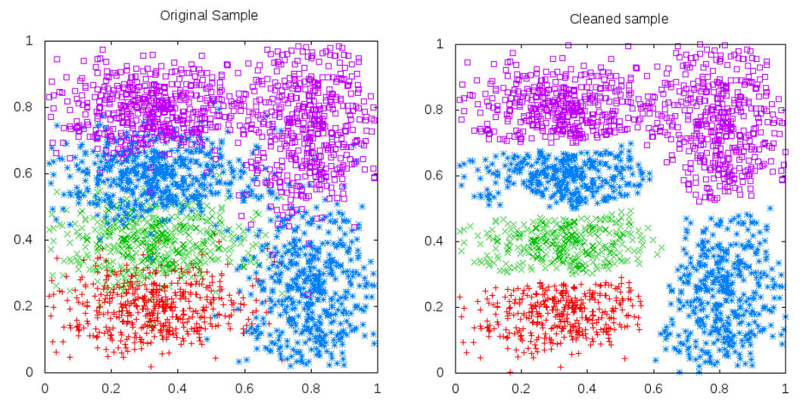

#### Étape 2 : Algorithme du cours qui supprime les exemples non pertinents :

Entrées : S (ensemble de données)

Sortie : STORAGE (ensemble de données réduit)

```md
Début
  1. STORAGE ← ∅ ; DUSTBIN ← ∅;
  2. Sélectionne aléatoirement un exemple d'apprentissage de S et place-le dans STORAGE.
  3. Tant qu'il n'y a pas de stabilisation de STORAGE, faire :
    3.1. Pour chaque xi ∈ S, faire :
      3.1.1. Si xi est correctement classé avec STORAGE en utilisant la règle du 1-NN, alors :
        DUSTBIN ← xi
      3.1.2. Fin
      3.1.3. STORAGE ← xi
    3.2. Fin
    3.3. STORAGE ← STORAGE \ DUSTBIN;
  4. Retourne STORAGE;
Fin
```

**Résultats de l'algorithme :**

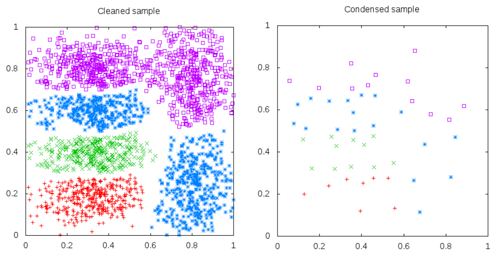


# Decision Trees & Random Forests :

## Introduction :

### Cross-Validation en détails :

Elle consiste à diviser l'ensemble de données en plusieurs parties, généralement appelées "folds", et à entraîner et tester le modèle sur chaque combinaison de ces parties. La validation croisée permet de réduire les biais liés à la séparation des données en ensembles d'entraînement et de test, et donne une estimation plus précise de la performance du modèle sur de nouvelles données.

#### Exemple :

Imaginons que nous avons un ensemble de données contenant 100 échantillons, et nous voulons évaluer un modèle de classification. Nous décidons d'utiliser la validation croisée à 5 folds. Voici comment cela fonctionne :

**1. Diviser les données :** Tout d'abord, nous divisons les données en 5 parties égales (folds), chacune contenant 20 échantillons. Ces 5 folds sont appelés Fold 1, Fold 2, Fold 3, Fold 4 et Fold 5.

**2. Entraîner et tester le modèle :** Nous entraînons et testons le modèle 5 fois, en utilisant à chaque fois un fold différent comme ensemble de test et les 4 autres folds comme ensemble d'entraînement. Voici un aperçu des différentes combinaisons :

- Itération 1 : Entraînement sur Fold 2, Fold 3, Fold 4 et Fold 5 ; Test sur Fold 1.
- Itération 2 : Entraînement sur Fold 1, Fold 3, Fold 4 et Fold 5 ; Test sur Fold 2.
- Itération 3 : Entraînement sur Fold 1, Fold 2, Fold 4 et Fold 5 ; Test sur Fold 3.
- Itération 4 : Entraînement sur Fold 1, Fold 2, Fold 3 et Fold 5 ; Test sur Fold 4.
- Itération 5 : Entraînement sur Fold 1, Fold 2, Fold 3 et Fold 4 ; Test sur Fold 5.

**3. Calculer la performance :** À chaque itération, nous calculons la performance du modèle sur l'ensemble de test (par exemple, la précision, le rappel, etc.). À la fin des 5 itérations, nous avons 5 valeurs de performance, une pour chaque fold.

**4. Estimer la performance moyenne :** Pour obtenir une estimation globale de la performance du modèle, nous calculons la moyenne des 5 valeurs de performance obtenues lors des différentes itérations.

La validation croisée nous donne une idée plus précise de la façon dont notre modèle se comportera sur de nouvelles données, car elle permet de mesurer la performance du modèle sur plusieurs combinaisons de données d'entraînement et de test. Cela rend l'évaluation du modèle plus robuste et réduit le risque de surapprentissage (overfitting).


### Matrice de confusion :

La matrice de confusion est un outil utilisé pour évaluer la qualité d'un modèle de classification binaire, c'est-à-dire un modèle qui classe les données en deux catégories (par exemple, positif ou négatif, vrai ou faux, etc.). Elle permet de visualiser la performance d'un algorithme de classification en comparant les prédictions du modèle aux valeurs réelles.

La matrice de confusion est composée de 4 cases :

1. Vrais positifs (VP) : Les cas où le modèle a prédit la classe positive et où la valeur réelle est effectivement positive.
2. Faux positifs (FP) : Les cas où le modèle a prédit la classe positive, mais la valeur réelle est négative.
3. Vrais négatifs (VN) : Les cas où le modèle a prédit la classe négative et où la valeur réelle est effectivement négative.
4. Faux négatifs (FN) : Les cas où le modèle a prédit la classe négative, mais la valeur réelle est positive.


#### Exemple :

Imaginons que nous ayons un modèle de classification binaire qui prédit si une personne est atteinte de diabète (classe positive) ou non (classe négative). Supposons que nous ayons testé le modèle sur 100 personnes et obtenu les résultats suivants :

- 40 personnes sont effectivement atteintes de diabète, et le modèle en a correctement identifié 35 (VP).
- 60 personnes ne sont pas atteintes de diabète, et le modèle en a correctement identifié 50 (VN).
- Le modèle a prédit que 5 personnes étaient atteintes de diabète, mais elles ne le sont pas en réalité (FP).
- Le modèle a prédit que 10 personnes n'étaient pas atteintes de diabète, mais elles le sont en réalité (FN).
- La matrice de confusion pour cet exemple ressemblera à ceci :

La matrice de confusion pour cet exemple ressemblera à ceci :

```md
               Prédictions
               +------+------+
               |  VP  |  FP  |
Valeurs réelles+------+------+ 
               |  FN  |  VN  |
               +------+------+
```

Dans notre exemple :

```md
               Prédictions
               +------+------+
               |  35  |   5  |
Valeurs réelles+------+------+ 
               |  10  |  50  |
               +------+------+
```

La matrice de confusion permet de calculer diverses mesures de performance, telles que la précision, le rappel, l'érreur et le F-score. Ces mesures donnent une idée plus précise de la qualité du modèle de classification binaire.

**Erreur :** L'erreur est la proportion de prédictions incorrectes par rapport au total des prédictions.
```
Erreur = (FP + FN) / (VP + FP + FN + VN) = (5 + 10) / (35 + 5 + 10 + 50) = 15 / 100 = 0,15
```
L'erreur dans cet exemple est de 0,15, soit 15%.

**Précision :** La précision est la proportion de prédictions positives correctes par rapport au total des prédictions positives.
```
Précision = VP / (VP + FP) = 35 / (35 + 5) = 35 / 40 = 0,875
```
La précision dans cet exemple est de 0,875, soit 87,5%.

**Rappel :** Le rappel est la proportion de prédictions positives correctes par rapport au total des valeurs réelles positives.
```
Rappel = VP / (VP + FN) = 35 / (35 + 10) = 35 / 45 = 0,7778
```
Le rappel dans cet exemple est de 0,7778, soit 77,78%.

**F-score :** Le F-score est une mesure qui combine la précision et le rappel en une seule valeur. Il est calculé en utilisant la formule suivante :
```
F-score = 2 * (Précision * Rappel) / (Précision + Rappel) = 2 * (0,875 * 0,7778) / (0,875 + 0,7778) = 2 * (0,6804) / (1,6528) = 0,8226
```
Le F-score dans cet exemple est de 0,8226, soit 82,26%.


## Décision Tree :

### Définition :

Un arbre de décision est un modèle de machine learning qui fonctionne comme un ensemble de questions-réponses pour prendre une décision. Imagine un jeu où tu dois deviner un animal en posant des questions pour réduire le nombre de possibilités jusqu'à ce qu'il n'en reste qu'une. Un arbre de décision fonctionne de la même manière en posant des questions sur les caractéristiques des données pour arriver à une conclusion.

Pour expliquer cela de manière très simple, imagine que tu joues à un jeu avec tes amis pour deviner leur animal préféré. Un arbre de décision pourrait ressembler à ceci :

1. Est-ce que l'animal vit dans l'eau ?
- Si oui, alors l'animal est un poisson.
- Si non, passe à la question suivante.
2. Est-ce que l'animal a des plumes ?
- Si oui, alors l'animal est un oiseau.
- Si non, passe à la question suivante.
3. Est-ce que l'animal a quatre pattes ?
- Si oui, alors l'animal est un chien.
- Si non, alors l'animal est un serpent.


Dans un arbre de décision utilisé en machine learning, les questions sont basées sur les caractéristiques des données (appelées attributs ou variables) et les réponses sont les classes ou catégories que nous voulons prédire.

Un arbre de décision est construit en suivant ces étapes :

**1. Choisir la meilleure question :** L'arbre commence par choisir la question qui permet de séparer au mieux les données en fonction de la caractéristique choisie. Cette question est choisie en fonction d'un critère mathématique, comme l'entropie ou l'indice de Gini, qui mesure la "pureté" des classes après la séparation.

**2. Diviser les données :** Ensuite, l'arbre divise les données en sous-ensembles en fonction des réponses à la question choisie.

**3. Répéter le processus :** Pour chaque sous-ensemble, l'arbre répète le processus de choix de la meilleure question et de division des données. L'arbre continue à se ramifier jusqu'à ce qu'il atteigne un certain critère d'arrêt, comme la profondeur maximale de l'arbre, ou si toutes les données d'un sous-ensemble appartiennent à la même classe.

**4. Prendre une décision :** À la fin, chaque "feuille" de l'arbre (c'est-à-dire les extrémités sans autre question) représente une classe ou une catégorie. Lorsqu'on utilise l'arbre de décision pour classer de nouvelles données, on suit simplement le chemin à travers l'arbre en répondant aux questions jusqu'à ce qu'on atteigne une feuille, et la classe associée à cette feuille est la prédiction du modèle.

Les arbres de décision sont faciles à comprendre et à interpréter, car ils ressemblent à un processus de prise de décision humaine. Cependant, ils peuvent être sensibles aux variations des données d'entraînement et peuvent parfois surapprendre (overfit), ce qui signifie qu'ils apprennent trop bien les données d'entraînement et ne généralisent pas bien sur de nouvelles données.

En résumé, un arbre de décision est un modèle de machine learning qui fonctionne en posant une série de questions sur les caractéristiques des données pour arriver à une décision. Les arbres de décision sont faciles à comprendre et à interpréter, mais peuvent parfois surapprendre. Pour résoudre ce problème, on peut utiliser des techniques de régularisation ou des méthodes d'ensemble qui combinent plusieurs arbres de décision.

#### Exemple :

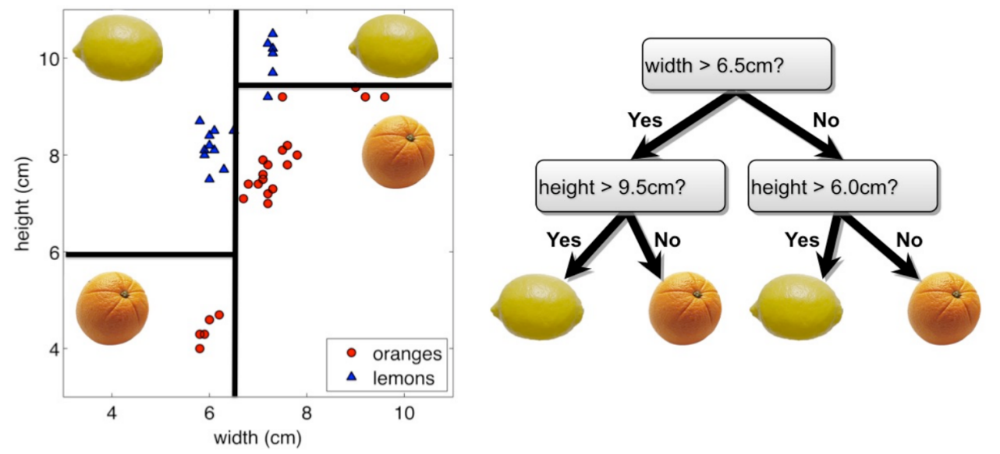
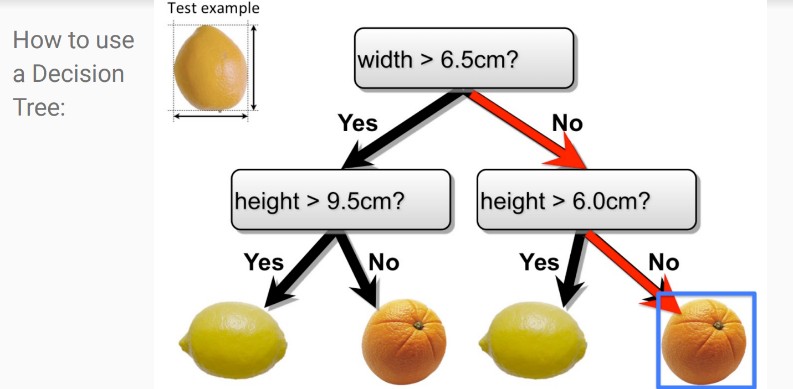

### Exemple pour choisir le meilleur décision tree :

#### Nos données :

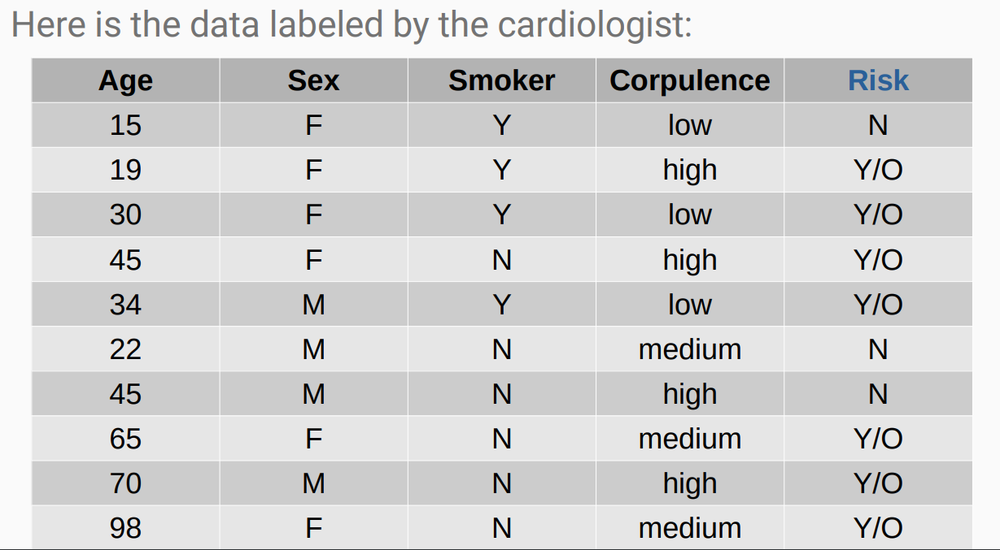

#### Choix de l'arbre de décision :

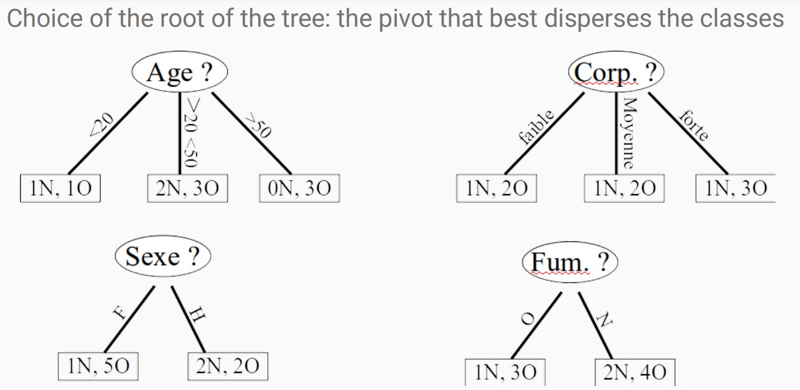
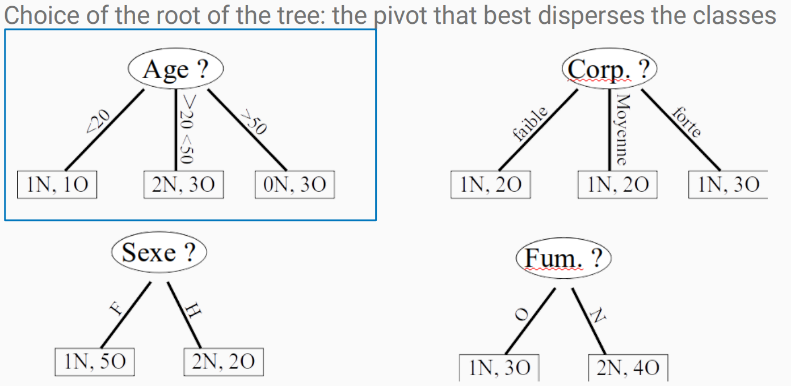
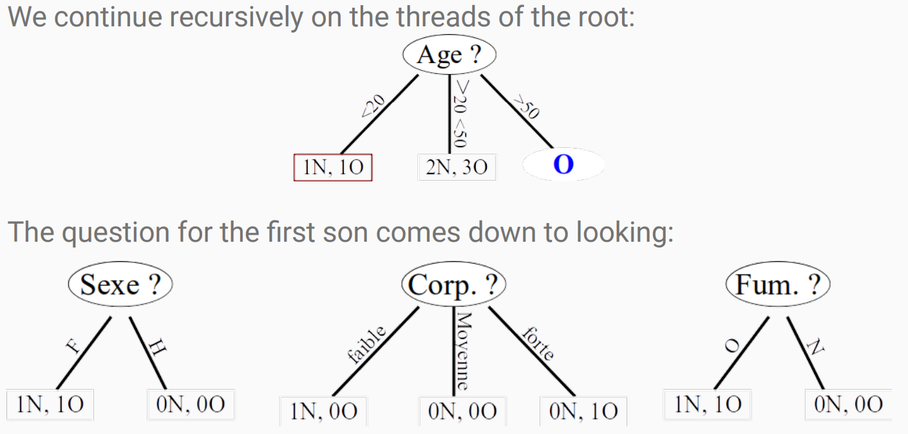
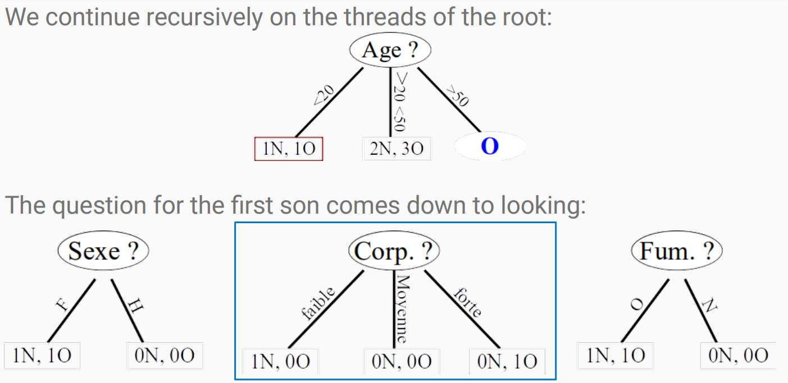
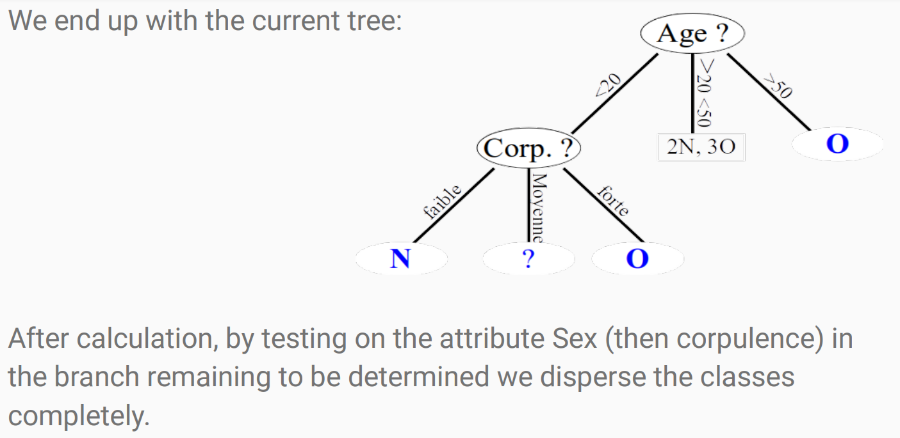
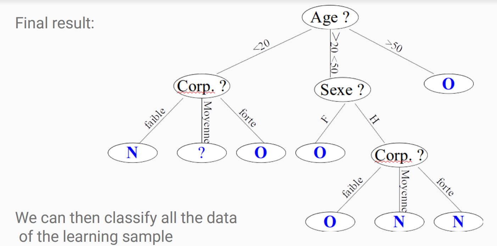


### Algorithmes :

Les algorithmes d'apprentissage des arbres de décision sont des méthodes pour créer des modèles d'arbres de décision à partir des données d'entraînement. Il existe deux étapes principales :

1. Construction d'un petit arbre de décision compatible
2. Élagage de l'arbre (suppression des branches inutiles)

La première étape consiste à diviser récursivement et efficacement l'échantillon d'entraînement par des tests d'attributs jusqu'à obtenir des sous-échantillons contenant (presque) uniquement des exemples de la même classe. Pour cela, on utilise des méthodes de construction ascendante (top-down), avides (greedy) et récursives.

Pour construire un arbre de décision, nous avons besoin de trois opérateurs qui nous permettent de :

1. Décider si un nœud est terminal
2. Si un nœud est terminal, lui attribuer une classe
3. Si un nœud n'est pas terminal, lui associer un test

L'algorithme générique se déroule comme suit :

```
1. Crée un arbre vide et définis le nœud actuel comme la racine.
2. Répète les étapes suivantes :
  a. Décide si le nœud actuel est terminal.
  b. Si le nœud est terminal, attribue-lui une classe.
  c. Sinon, sélectionne un test et crée autant de nœuds enfants qu'il y a de réponses possibles au test.
  d. Passe au nœud suivant (s'il existe).
3. Continue jusqu'à obtenir un arbre de décision compatible.
```

Les trois opérateurs fonctionnent comme suit :
```
1. Un nœud est terminal quand :
  a. Presque tous les exemples correspondant à ce nœud appartiennent à la même classe.
  b. Il n'y a plus d'attributs inutilisés dans la branche correspondante.
  c. On a atteint la profondeur maximale autorisée.
2. On attribue à un nœud terminal la classe majoritaire présente dans ce nœud (en cas de conflit, on peut choisir la classe majoritaire dans l'échantillon ou en choisir une au hasard).
3. On associe le test qui permet de faire le plus de progrès dans la classification des données d'entraînement. Pour mesurer ce progrès, on utilise généralement des critères comme l'entropie ou l'indice de Gini.
```

En résumé, les algorithmes d'apprentissage des arbres de décision permettent de construire des modèles d'arbres de décision en divisant récursivement et efficacement les données d'entraînement à l'aide de tests d'attributs. Pour ce faire, on utilise des opérateurs pour déterminer si un nœud est terminal, attribuer une classe à un nœud terminal et associer un test à un nœud non terminal.


### Gini index :

L'indice de Gini est une mesure utilisée pour évaluer la pureté ou l'homogénéité d'un ensemble de données. En termes d'arbres de décision, il est utilisé pour déterminer quelle caractéristique (ou attribut) doit être utilisée pour diviser les données à chaque étape. L'objectif est de choisir l'attribut qui minimise l'impureté des sous-ensembles résultants, c'est-à-dire qui permet de mieux séparer les différentes classes.

Expliquons cela de manière très simple, en utilisant une analogie. Imagine que tu as un sac plein de bonbons. Certains bonbons sont rouges, d'autres sont bleus et d'autres encore sont verts. Si tu veux séparer les bonbons par couleur, il faut choisir le meilleur moyen de le faire. L'indice de Gini nous aide à prendre cette décision.

#### Calcul de l'indice de Gini :

Pour calculer l'indice de Gini, on suit ces étapes :
```
1. Calcule la probabilité de chaque classe dans l'ensemble de données.
   Par exemple, si tu as 30 bonbons rouges, 20 bonbons bleus et 10 bonbons verts, la probabilité pour chaque classe est :
    - Probabilité (rouge) = 30 / (30 + 20 + 10) = 0,5
    - Probabilité (bleu) = 20 / (30 + 20 + 10) = 0,333
    - Probabilité (vert) = 10 / (30 + 20 + 10) = 0,167
  
2. Calcule l'indice de Gini pour l'ensemble de données en utilisant la formule suivante :
   Gini = 1 - (Probabilité(classe 1)^2 + Probabilité(classe 2)^2 + ... + Probabilité(classe n)^2)
   Dans notre exemple :
   Gini = 1 - (0,5^2 + 0,333^2 + 0,167^2) ≈ 0,611

3. Répète les étapes 1 et 2 pour chaque sous-ensemble de données résultant de la division en fonction de chaque attribut.

4. Calcule la diminution de l'indice de Gini pour chaque attribut en soustrayant l'indice de Gini pondéré des sous-ensembles résultants de l'indice de Gini initial. L'attribut avec la plus grande diminution de l'indice de Gini est choisi pour diviser les données.
```

Si tu n'a pas compris l'étape 3 (comme moi au début) voici une explication plus poussé : 

```
L'étape 3 signifie que nous devons répéter le processus de calcul de l'indice de Gini pour chaque sous-ensemble de données que nous obtenons en divisant l'ensemble initial en fonction de chaque attribut. Prenons un exemple pour illustrer cette étape.

Imaginons que nous ayons un ensemble de données avec les attributs suivants : "couleur" (rouge, bleu, vert) et "taille" (petit, moyen, grand). Notre objectif est de déterminer quel attribut (couleur ou taille) doit être utilisé pour diviser les données.

1. Tout d'abord, divise l'ensemble de données en fonction de l'attribut "couleur". Cela nous donnera trois sous-ensembles de données : un pour les bonbons rouges, un pour les bonbons bleus et un pour les bonbons verts.
2. Calcule l'indice de Gini pour chacun de ces sous-ensembles en suivant les étapes 1 et 2 décrites précédemment.
3. Calcule la diminution de l'indice de Gini résultant de la division des données en fonction de l'attribut "couleur".

Ensuite, répète ces étapes pour l'attribut "taille" :

1. Divise l'ensemble de données en fonction de l'attribut "taille". Cela nous donnera trois autres sous-ensembles : un pour les bonbons petits, un pour les bonbons moyens et un pour les bonbons grands.
2. Calcule l'indice de Gini pour chacun de ces sous-ensembles.
3. Calcule la diminution de l'indice de Gini résultant de la division des données en fonction de l'attribut "taille".

Après avoir calculé la diminution de l'indice de Gini pour chaque attribut, choisis l'attribut qui donne la plus grande diminution. Cela signifie que cet attribut est le meilleur pour diviser les données à cette étape, car il réduit le plus l'impureté des sous-ensembles résultants.
```

L'indice de Gini varie entre 0 et 1. Un indice de Gini de 0 signifie une pureté parfaite (tous les éléments de l'ensemble appartiennent à la même classe), tandis qu'un indice de Gini de 1 signifie une impureté maximale (les éléments de l'ensemble sont répartis de manière égale entre toutes les classes).

En résumé, l'indice de Gini est une mesure d'impureté utilisée dans les arbres de décision pour choisir l'attribut qui permet de mieux séparer les classes. Il est calculé en fonction des probabilités des classes et vise à minimiser l'impureté des sous-ensembles résultants.


**Exemple du cours :**

Les données :

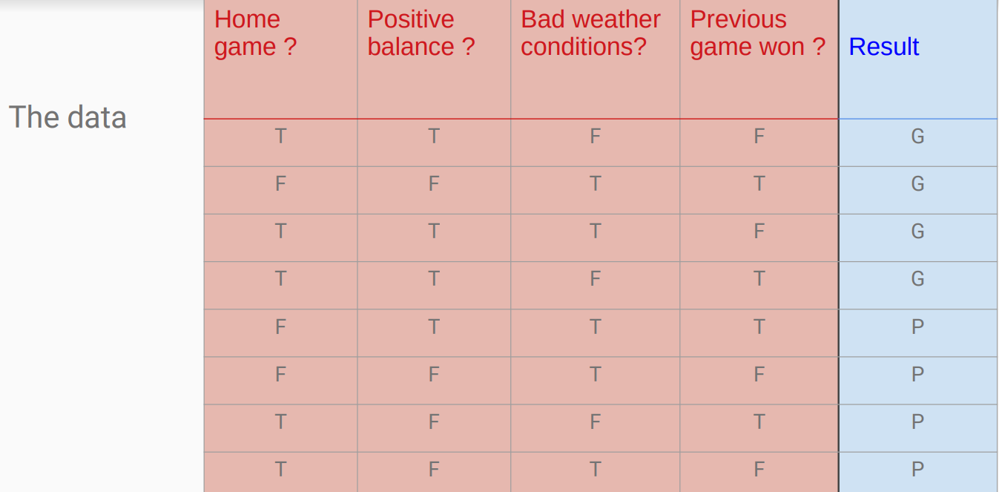

Gini de l'ensemble de données :

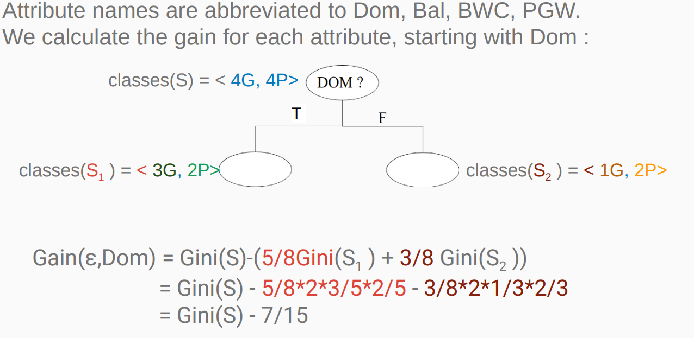
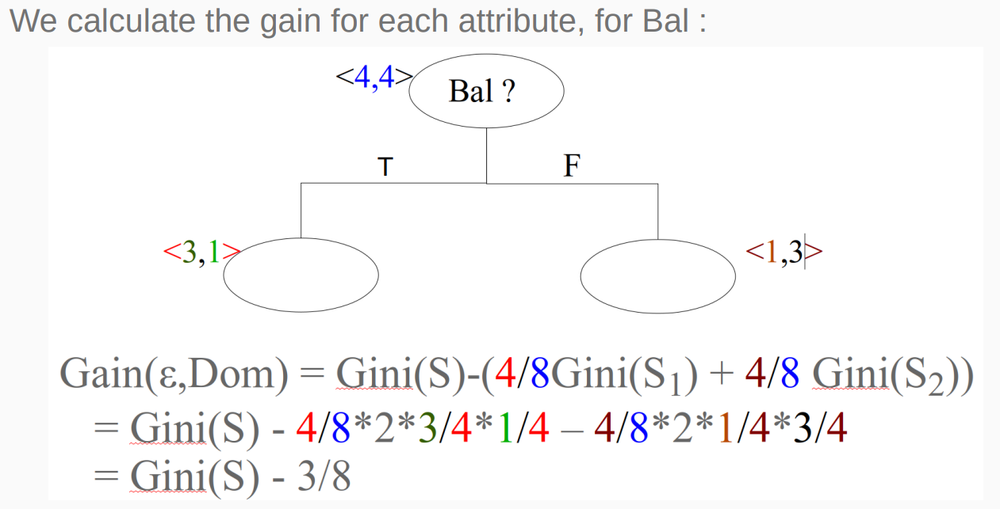
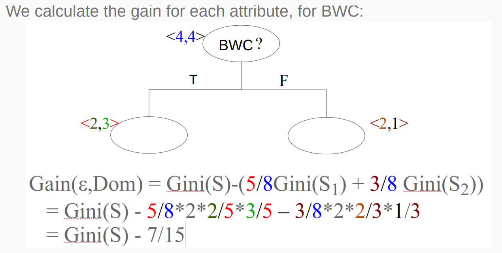
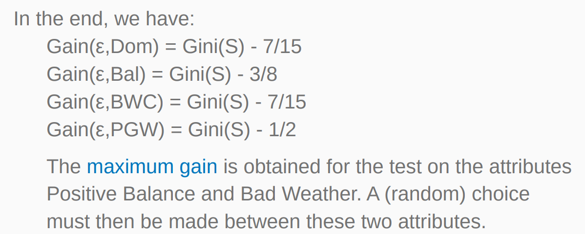
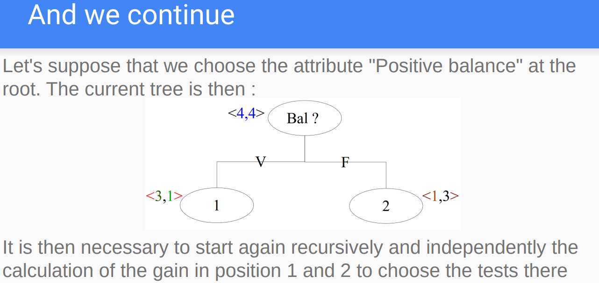
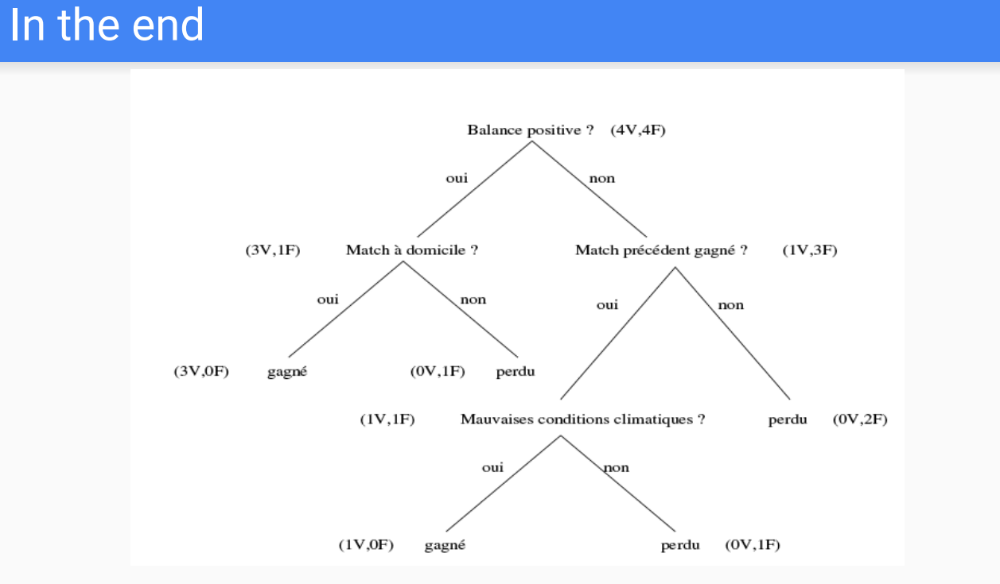


### Entropy :

#### Définition :

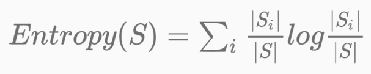

L'entropie est une autre mesure d'impureté ou de désordre utilisée dans les arbres de décision, tout comme l'indice de Gini. Elle est utilisée pour déterminer quel attribut doit être choisi pour diviser les données à chaque étape de la construction de l'arbre. L'entropie mesure le niveau de désordre ou d'incertitude dans un ensemble de données. Un ensemble de données parfaitement homogène aura une entropie de 0, tandis qu'un ensemble de données où les éléments sont répartis de manière égale entre toutes les classes aura une entropie maximale.

Expliquons cela de manière très simple avec une analogie. Imagine que tu as un sac plein de bonbons de différentes couleurs, tout comme dans l'exemple précédent. Si tous les bonbons sont de la même couleur, il n'y a aucun désordre dans le sac, et l'entropie est égale à 0. Si les bonbons sont répartis de manière égale entre différentes couleurs, l'entropie est maximale, car il y a beaucoup de désordre dans le sac.

#### Calcul de l'entropie :

Pour calculer l'entropie d'un ensemble de données, on suit ces étapes :
```
1. Calcule la probabilité de chaque classe dans l'ensemble de données.
   Par exemple, si tu as 30 bonbons rouges, 20 bonbons bleus et 10 bonbons verts, la probabilité pour chaque classe est :
    - Probabilité (rouge) = 30 / (30 + 20 + 10) = 0,5
    - Probabilité (bleu) = 20 / (30 + 20 + 10) = 0,333
    - Probabilité (vert) = 10 / (30 + 20 + 10) = 0,167

2. Calcule l'entropie pour l'ensemble de données en utilisant la formule suivante :
   Entropie = -∑ [Probabilité(classe i) * log2(Probabilité(classe i))]
   Dans notre exemple :
   Entropie = -(0,5 * log2(0,5) + 0,333 * log2(0,333) + 0,167 * log2(0,167)) ≈ 1,252
```
Pour choisir l'attribut qui doit être utilisé pour diviser les données à chaque étape de la construction de l'arbre, on calcule la diminution de l'entropie (également appelée gain d'information) pour chaque attribut. On choisit ensuite l'attribut qui donne la plus grande diminution de l'entropie.

En résumé, l'entropie est une mesure d'impureté ou de désordre utilisée dans les arbres de décision pour déterminer quel attribut doit être choisi pour diviser les données à chaque étape. Elle est calculée en fonction des probabilités des classes et vise à minimiser le désordre des sous-ensembles résultants.


#### Schéma :

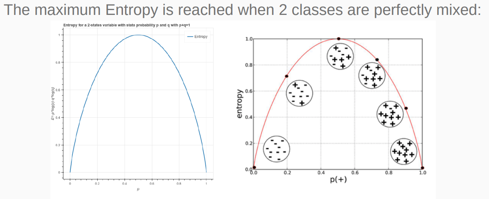
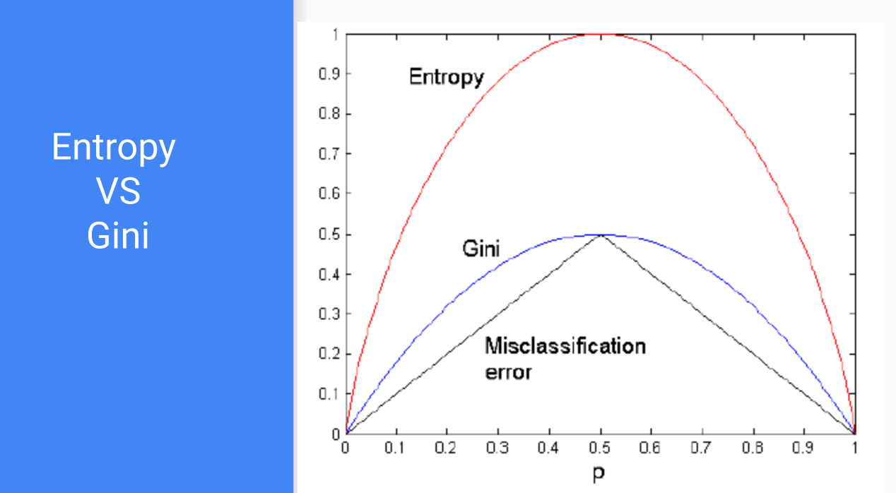


### Exercice Decision Tree :

**Question :** Will I play tennis today?

**Attributes :**
- Outlook {Sun, Overcast, Rain}
- Temperature {Hot, Mild, Cold}
- Humidity {High, Normal, Low }
- Wind {Strong , Weak}

**Labels :**
- Binary classification Y = {Yes, No}

**Data :**

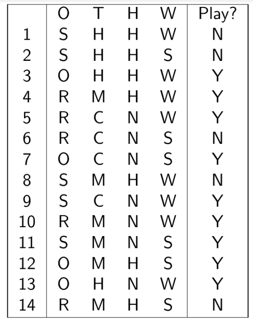

#### Do the computation of the Gini index :

Dans cet exercice, nous avons un ensemble de données qui décrit différentes conditions météorologiques (Outlook, Temperature, Humidity et Wind) et si l'on a joué au tennis (Play) ou non sous ces conditions. L'objectif est de déterminer si nous pouvons jouer au tennis aujourd'hui en fonction des conditions météorologiques données : O (Outlook), T (Temperature), H (Humidity) et W (Wind).

Pour résoudre cet exercice, nous allons d'abord construire un arbre de décision en utilisant l'indice de Gini pour choisir les attributs à chaque étape.

```
1. Calcule l'indice de Gini initial pour l'ensemble de données.
  Nous avons 9 cas où nous avons joué au tennis (Y) et 5 cas où nous n'avons pas joué (N).
  - Probabilité(Y) = 9 / (9 + 5) = 0,643
  - Probabilité(N) = 5 / (9 + 5) = 0,357
  Gini_initial = 1 - (Probabilité(Y)^2 + Probabilité(N)^2) = 1 - (0,643^2 + 0,357^2) ≈ 0,459

2. Calcule la diminution de l'indice de Gini pour chaque attribut.
  Pour chaque attribut, nous devons diviser l'ensemble de données en sous-ensembles en fonction des valeurs de l'attribut, puis calculer l'indice de Gini pour chaque sous-ensemble. Ensuite, nous calculons la diminution de l'indice de Gini résultant de la division des données en fonction de cet attribut.

  Prenons par exemple l'attribut "Outlook" :
  - Sous-ensemble "Sun" (S) : 3 cas Y, 2 cas N
    - Probabilité(Y) = 3 / (3 + 2) = 0,6
    - Probabilité(N) = 2 / (3 + 2) = 0,4
    - Gini_Sun = 1 - (0,6^2 + 0,4^2) = 0,48
  - Sous-ensemble "Overcast" (O) : 4 cas Y, 0 cas N
    - Probabilité(Y) = 4 / (4 + 0) = 1
    - Probabilité(N) = 0 / (4 + 0) = 0
    - Gini_Overcast = 1 - (1^2 + 0^2) = 0
  - Sous-ensemble "Rain" (R) : 2 cas Y, 3 cas N
    - Probabilité(Y) = 2 / (2 + 3) = 0,4
    - Probabilité(N) = 3 / (2 + 3) = 0,6
    - Gini_Rain = 1 - (0,4^2 + 0,6^2) = 0,48

  La diminution de l'indice de Gini pour "Outlook" :
    Gini_reduction_Outlook = Gini_initial - ( (5/14) * Gini_Sun + (4/14) * Gini_Overcast + (5/14) * Gini_Rain) ≈ 0,244

  De la même manière, calcule la diminution de l'indice de Gini pour les autres attributs (emperature, Humidity et Wind). Je vais te donner les valeurs de réduction de Gini pour chaque attribut pour gagner du temps :
    - Gini_reduction_Temperature ≈ 0,029
    - Gini_reduction_Humidity ≈ 0,151
    - Gini_reduction_Wind ≈ 0,032

3. Sélectionne l'attribut avec la plus grande diminution de l'indice de Gini.

  Dans notre cas, l'attribut "Outlook" a la plus grande diminution de l'indice de Gini (0,244). Nous allons donc diviser notre ensemble de données en fonction de cet attribut.

4. Répète les étapes 1 à 3 pour chaque sous-ensemble de données résultant de la division en fonction de chaque attribut.

  Nous devons maintenant répéter le processus pour chaque sous-ensemble ("Sun", "Overcast" et "Rain") et choisir les attributs suivants jusqu'à ce que nous atteignions un nœud terminal pour chaque branche.

  Je vais te donner le résultat final pour gagner du temps :
    - Si Outlook = Sun, Temperature = Hot, Humidity = High et Wind = Weak, alors Play = No (selon l'exemple 1)
    - Si Outlook = Overcast, alors Play = Yes (car tous les exemples avec Overcast ont Play = Yes)

Maintenant, pour répondre à ta question : si O (Outlook) = Sun, T (Temperature) = Hot, H (Humidity) = High et W (Wind) = Weak, selon notre arbre de décision, nous ne jouerons pas au tennis aujourd'hui (Play = No).
```

#### Draw the decision tree found with the Gini index :

```
          Outlook
          /  |  \
         /   |   \
        S    O    R
       /     |     \
      T      Y      H
     / \           / \
    H   M         H   N
   /     \       /     \
  Y       Y     Y       N

```

Dans cet arbre de décision, les lettres S, O, R représentent les valeurs de l'attribut "Outlook" (Sun, Overcast, Rain). Les lettres T, H, M et N représentent les autres attributs et valeurs (Temperature, Humidity). Les lettres Y et N à la fin des branches représentent les résultats (Play = Yes ou No).

Voici comment lire cet arbre de décision :
- Si Outlook = Sun (S), alors on regarde l'attribut Temperature (T). Si Temperature = Hot (H), alors Play = Yes (Y). Si Temperature = Mild (M), alors Play = Yes (Y).
- Si Outlook = Overcast (O), alors Play = Yes (Y) directement.
- Si Outlook = Rain (R), alors on regarde l'attribut Humidity (H). Si Humidity = High (H), alors Play = Yes (Y). Si Humidity = Normal (N), alors Play = No (N).


## Random Forest

### Définition :

Le "Random Forest" (Forêt aléatoire) est une méthode de machine learning qui combine plusieurs arbres de décision pour créer un modèle de classification ou de régression plus puissant et précis. L'idée principale derrière les forêts aléatoires est de tirer parti de la "sagesse de la foule". Au lieu de se fier à un seul arbre de décision, on construit plusieurs arbres de décision indépendants et on combine leurs prédictions pour obtenir un résultat plus fiable.

Voici comment fonctionne le Random Forest en gros :

**1. Sélection aléatoire d'exemples :** Pour chaque arbre de décision, nous sélectionnons aléatoirement un sous-ensemble d'exemples d'apprentissage (avec remise) à partir de notre ensemble de données initial. Cela signifie que chaque arbre de la forêt aléatoire est entraîné sur un sous-ensemble légèrement différent des données.

**2. Sélection aléatoire des attributs :** Lors de la construction de chaque arbre de décision, nous choisissons également un sous-ensemble aléatoire des attributs (ou caractéristiques) à considérer pour chaque division (ou nœud). Cette étape ajoute de la diversité aux arbres et rend la forêt aléatoire plus robuste.

**3. Construction de l'arbre de décision :** Nous construisons chaque arbre de décision de manière récursive et sans élagage. L'algorithme de construction de l'arbre est similaire à celui que nous avons vu précédemment (par exemple, en utilisant l'indice de Gini ou l'entropie pour choisir les meilleurs attributs), mais en limitant les attributs à choisir au sous-ensemble aléatoire à chaque nœud.

**4. Combinaison des prédictions :** Une fois que tous les arbres de la forêt aléatoire ont été construits, nous pouvons utiliser la forêt pour faire des prédictions. Pour un problème de classification, chaque arbre de la forêt fait une prédiction indépendante, et la classe qui obtient le plus grand nombre de "votes" parmi tous les arbres est choisie comme prédiction finale. Pour un problème de régression, la prédiction finale est généralement la moyenne des prédictions de tous les arbres.

Les avantages des forêts aléatoires incluent :

**Robustesse :** Les forêts aléatoires sont moins sensibles au surapprentissage que les arbres de décision individuels, car elles combinent les prédictions de plusieurs arbres indépendants.
**Précision :** Les forêts aléatoires sont souvent plus précises que les arbres de décision individuels, car elles bénéficient de la diversité des arbres et de la "sagesse de la foule".
**Facilité d'utilisation :** Les forêts aléatoires sont relativement faciles à mettre en œuvre et à régler, et elles fonctionnent bien avec une grande variété de problèmes de machine learning.

En résumé, le Random Forest est une méthode de machine learning qui combine plusieurs arbres de décision pour obtenir des prédictions plus précises et robustes. Il est basé sur l'idée d'utiliser la "sagesse de la foule" en combinant les prédictions de plusieurs arbres indépendants.


### Algorithme (expliqué vite fait) :

#### Apprentissage :

**Entrée :** un ensemble S de n données, un entier K

```
1. Créer K ensembles de n données en effectuant un tirage avec remplacement. Cela signifie que nous prenons aléatoirement des exemples de notre ensemble de données initial pour créer de nouveaux ensembles. Chaque ensemble peut contenir plusieurs fois le même exemple.

2. Apprendre K arbres de décision, un pour chaque ensemble de données. Entraîner chaque arbre sur l'un des ensembles de données créés à l'étape précédente. Pendant la construction de chaque arbre, nous choisissons aléatoirement un sous-ensemble d'attributs à considérer pour chaque division (ou nœud), ce qui ajoute de la diversité aux arbres.

3. "Retourner la forêt à l'envers" : Cette expression signifie simplement que nous avons maintenant une collection d'arbres de décision (la forêt) qui est prête à être utilisée pour la classification.
```

#### Classification :

Lorsqu'une nouvelle donnée doit être classée, nous examinons la classe donnée par chacun des K arbres :
```
1. La forêt retourne la classe majoritaire (décision par vote majoritaire). Autrement dit, chaque arbre fait une prédiction indépendante, et la classe qui obtient le plus grand nombre de "votes" parmi tous les arbres est choisie comme prédiction finale.
```

#### Résumé :

Habituellement, K est de l'ordre de quelques centaines, et n correspond à 66% du nombre total de données. Cela signifie que chaque ensemble de données créé à l'étape 1 contient environ 66% des exemples de l'ensemble de données initial.

En résumé, l'algorithme du Random Forest consiste à créer plusieurs ensembles de données par tirage avec remplacement, à entraîner un arbre de décision sur chaque ensemble, puis à combiner les prédictions des arbres pour obtenir une prédiction finale par vote majoritaire.


### Exemple du cours :

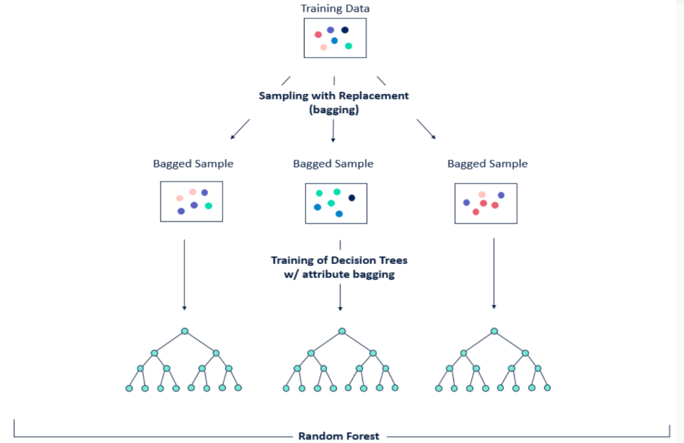
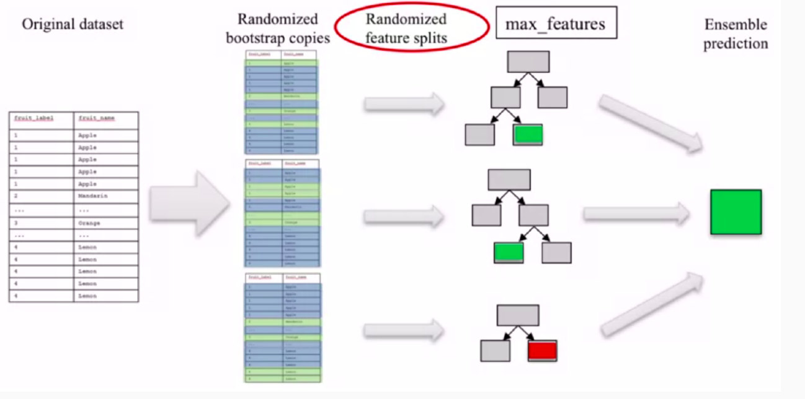


# Perceptron and Support Vector Machines (SVM)

## Perceptron

### Définition :

Le perceptron est un algorithme simple d'apprentissage supervisé pour la classification binaire, c'est-à-dire pour classer des données en deux catégories. Il s'agit d'un modèle de base dans le domaine de l'apprentissage automatique et des réseaux de neurones.

Imagine que tu as des points sur une feuille de papier, et que chaque point appartient à l'une des deux catégories (par exemple, des points rouges et des points bleus). Le but du perceptron est de trouver une ligne droite (ou une frontière de décision) qui sépare le mieux possible les points rouges des points bleus.

Un perceptron est constitué d'un neurone unique qui prend en entrée plusieurs caractéristiques ou attributs (aussi appelés "features") d'un exemple et produit une sortie binaire. Chaque caractéristique est associée à un poids, qui représente l'importance de cette caractéristique pour la décision finale. Le neurone combine les caractéristiques et leurs poids respectifs, puis utilise une fonction d'activation (souvent une fonction seuil) pour produire la sortie binaire.

Le perceptron apprend à partir d'exemples d'apprentissage en ajustant les poids des caractéristiques. L'objectif est de trouver les poids qui permettent de classer correctement les exemples d'apprentissage. Une fois que les poids sont déterminés, le perceptron peut être utilisé pour classifier de nouveaux exemples en entrée.

### Linear binary classififcation

La méthode de classification la plus simple et pourtant la plus efficace !

#### Données
Des vecteurs de valeurs numériques de dimension d (X ⊂ R^d) avec en plus l'information à apprendre (classification supervisée) composée de 2 classes (classification binaire) (Y = {-1, +1}).

#### Classificateur linéaire
Un classificateur linéaire (ou un perceptron) est une fonction de la forme :
f(x) = { +1 si <w, x> + b ≥ 0; -1 sinon. }
où :
- w = (w1, ..., wd) est un vecteur (math : w ∈ R^d),
- b est un nombre réel (math : b ∈ R)
- la notation <w, x> représente le produit scalaire entre w et x :
- si w = (w1, ..., wd) et x = (x1, ..., xd), 
  alors <w, x> = somme(wixi pour i=1 à d) = x1w1 + x2w2 + ... + xdwd

#### Interprétation géométrique
<w, x> + b = 0 est l'équation d'un hyperplan qui sépare X en deux demi-espaces correspondant aux deux classes.

Si d = 2, nous trouvons l'équation d'une ligne : <w, x> + b = w1x1 + w2x2 + b = 0 donne x2 = -(w1/w2) * x1 - (b/w2) (similaire à y = ax + b de vos cours de lycée...).

Prenons w = (1, 2) et b = -1 :

f(x) = f(x1, x2) = { 1 si x1 + 2*x2 - 1 ≥ 0; -1 sinon }

Par exemple, f(0, 0) = -1 et f(1, 1) = 1 : 

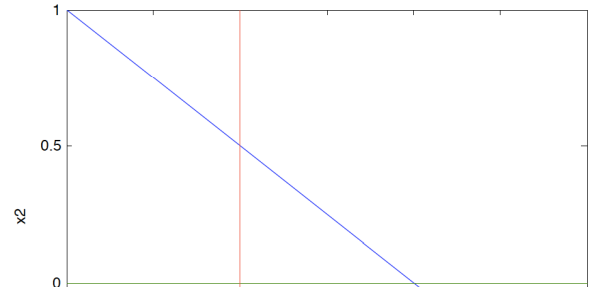


### Linearly separable data

Un échantillon (en math : S = {(x1, y1), ..., (xn, yn) ⊂ (X × Y)^n}) est linéairement séparable s'il existe un classificateur linéaire qui classe correctement tous les exemples de S.

#### Lemme (séparabilité stricte)

S'il existe un classificateur qui classe parfaitement les données d'apprentissage, alors il existe un classificateur qui classe ces données sans qu'aucune d'entre elles ne se trouve sur la frontière de décision, b + <w, x> ≠ 0.

#### Exemple

S = {((0, 0), -1), ((1, 0), 1), ((0, 1), -1)} est linéairement séparable.
S = {((0, 0), -1), ((1, 0), 1), ((0, 1), 1), ((1, 1), -1)} n'est pas linéairement séparable (XOR).

**Explication :**

1. Dans le premier exemple, S = {((0, 0), -1), ((1, 0), 1), ((0, 1), -1)}, nous avons trois points avec deux classes différentes (-1 et 1). Si nous traçons ces points sur un graphique, nous pouvons clairement dessiner une ligne (un classificateur linéaire) qui sépare les points de la classe -1 des points de la classe 1.

2. Dans le deuxième exemple, S = {((0, 0), -1), ((1, 0), 1), ((0, 1), 1), ((1, 1), -1)}, nous avons quatre points avec deux classes différentes (-1 et 1). Si nous traçons ces points sur un graphique, nous ne pouvons pas dessiner une seule ligne (un classificateur linéaire) qui sépare les points de la classe -1 des points de la classe 1. Cette configuration de points est un exemple classique du problème XOR, qui n'est pas linéairement séparable.


### Calcul Perceptron

Un perceptron avec un vecteur de poids w et un biais b effectue le calcul suivant :
(x1, ..., xd) 7→ y = sgn(b + ∑d_i=1(wixi)) = sgn(b + <w, x>)
avec :
- sgn(z) = { +1 si z ≥ 0, -1 si z < 0 }

**Remarques :**
Les isométries et les homothéties préservent la séparabilité. En d'autres termes, si les données sont linéairement séparables, elles le resteront après une transformation isométrique (rotation, réflexion) ou homothétique (mise à l'échelle).

Il existe une infinité d'hyperplans séparant les données séparables. Cela signifie que, lorsqu'un ensemble de données est linéairement séparable, il y a de nombreuses façons de tracer un hyperplan qui sépare les classes. Chaque hyperplan correspond à un ensemble différent de poids et de biais pour le perceptron.

**Geometrical interpretation**

- données x = (x1, ..., xd) : les données sont représentées sous forme de vecteurs x, qui appartiennent à un espace de dimension d.
- points vérifiant b + <w, x> = 0 : ces points appartiennent à l'hyperplan défini par le biais b et le vecteur de poids w.
- points vérifiant b + <w, x> > 0 : ces points se situent d'un côté de l'hyperplan.
- points vérifiant b + <w, x> < 0 : ces points se trouvent de l'autre côté de l'hyperplan.

Un perceptron divise l'espace de données en deux demi-espaces situés de part et d'autre de l'hyperplan. L'objectif est de séparer les classes d'exemples en plaçant une classe d'un côté de l'hyperplan et l'autre classe de l'autre côté. Ainsi, lorsque de nouvelles données sont présentées au perceptron, il peut déterminer à quelle classe elles appartiennent en fonction de leur position par rapport à l'hyperplan.

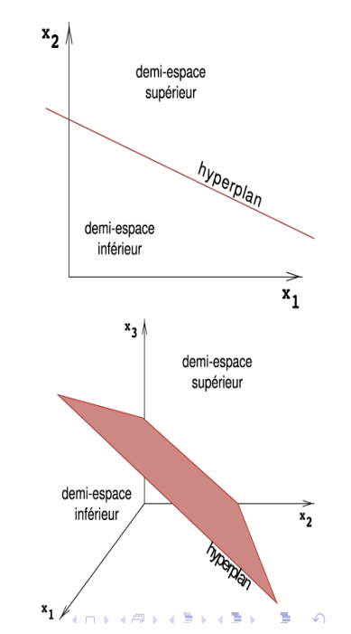

### 1st learning algorithm : 

#### Data
Un ensemble de données S = {(x1, y1), ... ,(xn, yn)}, avec pour tout i, xi = (xi1, xi2, ... , xid) ∈ R^d et yi ∈ {-1, +1}. Si yi = +1, on dit que xi est un exemple positif. Inversement, si yi = -1, on dit que xi est un exemple négatif.

#### Task
Générer un perceptron qui renvoie 1 pour tous les exemples positifs et -1 pour les exemples négatifs.

#### Choses a savoir :
Évidemment, il existe des cas où l'algorithme d'apprentissage du perceptron n'est pas capable de résoudre le problème de classification :
- exemple : (xi, +1) ∈ S et (xj, -1) ∈ S avec xi = xj
- données non linéairement séparables

→ Il existe des solutions pour gérer cela (par exemple, les SVM avec noyaux et les réseaux de neurones).

#### Les erreurs :

**Sur un exemple positif :**
Erreur de classification de (→x, +1) ∈ S

→ b + ⟨→w, →x⟩ < 0

Comment modifier b et →w pour éliminer cette erreur ?
→ augmenter b + ⟨→w, →x⟩
- augmenter b
- Si xi > 0, augmenter wi
- Si xi < 0, diminuer wi

Algorithme : ajouter →x à →w et 1 à b

Pour corriger l'erreur de classification d'un exemple positif, il faut augmenter la valeur de b + ⟨→w, →x⟩. Pour ce faire, on peut augmenter b et ajuster les poids wi en fonction de la valeur de xi : si xi est positif, on augmente wi ; si xi est négatif, on diminue wi. L'algorithme consiste alors à ajouter →x à →w et 1 à b.

**Sur un exemple négatif :**
Procéder de manière analogue pour les exemples négatifs (→x, -1)

Pour corriger l'erreur de classification d'un exemple négatif, on procède de manière similaire, mais en ajustant les poids et le biais dans la direction opposée. Ainsi, on cherche à réduire la valeur de b + ⟨→w, →x⟩ en diminuant b et en ajustant les poids wi de manière opposée à celle utilisée pour les exemples positifs.


#### L'algorithme :

**Entrée :** S = {(x1, y1), ..., (xn, yn)}, un échantillon R^d × {−1, +1} linéairement séparable
```
w = →0 ∈ Rd, b = 0
Répéter
  Pour i = 1 à n
    Si ⟨w, xi⟩ + b < 0 et yi = +1 alors
      w = w + xi
      b = b + 1
    Si ⟨w, xi⟩ + b ≥ 0 et yi = -1 alors
      w = w - xi
      b = b - 1
  FinPour
Jusqu'à ce qu'il n'y ait plus d'erreurs
```

**Sortie :** (w, b)

**Expliquation :**
1. Initialisation : On commence par initialiser le vecteur de poids w à zéro (→0) et le biais b à 0.

2. Répétition : On répète les étapes suivantes jusqu'à ce qu'il n'y ait plus d'erreurs de classification.

3. Pour chaque exemple (xi, yi) dans l'échantillon S, on vérifie si la classification est correcte ou non.

- Si la classification est incorrecte et que yi = +1 (exemple positif mal classé), on met à jour le vecteur de poids w et le biais b comme suit :
  - w = w + xi (ajouter le vecteur xi au vecteur w)
  - b = b + 1 (incrémenter le biais de 1)

- Si la classification est incorrecte et que yi = -1 (exemple négatif mal classé), on met à jour le vecteur de poids w et le biais b comme suit :
  - w = w - xi (soustraire le vecteur xi du vecteur w)
  - b = b - 1 (décrémenter le biais de 1)

4. L'algorithme se termine lorsque tous les exemples sont correctement classés. La sortie est le vecteur de poids w et le biais b qui définissent le perceptron.

Cet algorithme fonctionne uniquement pour des échantillons linéairement séparables. Si les données ne sont pas linéairement séparables, l'algorithme ne convergera pas vers une solution.


### 2nd learning algorithm (completed data) :

Pour simplifier les calculs, on utilise souvent (toujours !) une astuce mathématique pour éviter de traîner le scalaire b tout le temps.

#### Idée :
Ajouter une dimension : si nos données sont de dimension d, donc dans Rd, nous ferons comme si elles étaient dans Rd+1 et qu'elles avaient toutes 1 en dernière coordonnée. Ainsi, nous considérons que w est également de dimension d+1 et la dernière coordonnée de w est b.

#### Mathématiquement :
f(x) = signe(b + <w, x>) = sgn(b + Σ_(i=1..d wixi))

= sgn(b · 1 + Σ_(i=1..d wixi))

= sgn(Σ_(i=1..d+1) wixi) avec wd+1 = b et xd+1 = 1

= sgn(<(w1, ..., wd, b), (x1, ..., xd, 1)>)

On dit que les données sont complétées si elles sont dans Rd+1.

Soit S ⊂ Rd+1 × {−1, +1} un échantillon linéairement séparable.

Soit w le classificateur linéaire actuel.

- Si (x, +1) ∈ S est mal classé, ⟨w, x⟩ < 0 et il faut augmenter ⟨w, x⟩.

- Si (x, -1) ∈ S est mal classé, ⟨w, x⟩ ≥ 0 et il faut diminuer ⟨w, x⟩.

#### Ébauche :
Soit w_new = w + x · y

Pour y = +1, nous avons

⟨w_new, x⟩ = ⟨w + x · (+1), x⟩ = ⟨w, x⟩ + ⟨x, x⟩ = ⟨w, x⟩ + ||x||^2

Pour y = -1, nous avons

⟨w_new, x⟩ = ⟨w + x · (-1), x⟩ = ⟨w, x⟩ - ⟨x, x⟩ = ⟨w, x⟩ - ||x||^2

#### Algorithme :

**Entrée :** S = {(x₁, y₁), ..., (xₙ, yₙ)}, un échantillon R^d+1 × {−1, +1} complété et linéairement séparable
```
w = −→0 ∈ Rd+1
Répéter
  Pour i = 1 à n
    Si yᵢ⟨w, xᵢ⟩ ≤ 0 alors
      w = w + yᵢxᵢ
  FinPour
Jusqu'à ce qu'il n'y ait plus d'erreur
```

**Sortie :** w

Cet algorithme d'apprentissage du perceptron prend en entrée un ensemble de données complété (S) et linéairement séparable. Le vecteur des poids w est initialisé à zéro dans Rd+1.

L'algorithme répète ensuite les étapes suivantes jusqu'à ce qu'il n'y ait plus d'erreurs de classification :

1. Parcourir les données de 1 à n.
2. Pour chaque donnée (xᵢ, yᵢ), vérifier si yᵢ⟨w, xᵢ⟩ ≤ 0.
3. Si la condition est vraie, mettre à jour le vecteur des poids : w = w + yᵢxᵢ.


Une fois que l'algorithme ne détecte plus d'erreurs de classification, il renvoie le vecteur des poids w comme sortie. Cet algorithme apprend les poids et le biais du perceptron de manière à bien classer les données d'entrée linéairement séparables.

### 3rd learning algorithm (Dual form):

#### Remarque :

L'hypothèse finale (= la sortie w) est une combinaison linéaire des exemples d'apprentissage.
- w = Σ(αᵢyᵢxᵢ) pour i = 1 à n
Les nombres αᵢ sont positifs ou nuls, et sont égaux au nombre de fois qu'une mauvaise classification de xᵢ a provoqué une mise à jour du perceptron. Ils peuvent être considérés comme une représentation duale de la solution :
- f(x) = sgn(⟨w, x⟩) = sgn(⟨Σ(αᵢyᵢxᵢ), x⟩) = sgn(Σ(αᵢyᵢ⟨xᵢ, x⟩)).

#### Algorithme :

**Entrée :** S = {(x₁, y₁), ..., (xₙ, yₙ)}, un échantillon complété et linéairement séparable

```
α = −→0 ∈ Rₙ
Répéter
  Pour i = 1 à n
    Si yᵢ(Σ(αⱼyⱼ⟨xⱼ, xᵢ⟩)) ≤ 0 alors
      αᵢ = αᵢ + 1
    FinSi
  FinPour
Jusqu'à ce qu'il n'y ait plus d'erreur
```

**Sortie :** α

Cet algorithme prend en entrée un échantillon complété et linéairement séparable (S) et initialise le vecteur α à zéro.

L'algorithme répète ensuite les étapes suivantes jusqu'à ce qu'il n'y ait plus d'erreurs de classification :

1. Parcourir les données de 1 à n.
2. Pour chaque donnée (xᵢ, yᵢ), vérifier si yᵢ(Σ(αⱼyⱼ⟨xⱼ, xᵢ⟩)) ≤ 0.
3. Si la condition est vraie, mettre à jour le vecteur α : αᵢ = αᵢ + 1.

Une fois que l'algorithme ne détecte plus d'erreurs de classification, il renvoie le vecteur α comme sortie. Cette forme duale de l'algorithme du perceptron apprend une représentation alternative de la solution, basée sur les coefficients α plutôt que sur les poids w.


## Support Vector Machine (SVM) :

### The notion of margin :

La distance entre un point M ∈ R^d et un hyperplan h défini par le vecteur w et le scalaire b tels que ⟨w, x⟩ + b = 0 est donnée par :
- d(M, h) = |⟨w, M⟩ + b| / ||w||

Dans ce cas, la distance d'un exemple (x, y) à un hyperplan séparateur est égale à :
- y(⟨w, x⟩ + b) / ||w||

En termes simples, la notion de marge fait référence à la distance entre un point (ou un exemple) et un hyperplan séparateur. L'hyperplan séparateur est défini par un vecteur w et un scalaire b, et la distance d'un exemple (x, y) à cet hyperplan est calculée en utilisant la formule mentionnée ci-dessus.

La marge est un concept important dans l'apprentissage supervisé, en particulier pour les algorithmes de classification tels que les machines à vecteurs de support (SVM). L'idée principale est de maximiser la marge, c'est-à-dire de trouver l'hyperplan séparateur qui maximise la distance minimale entre les points et l'hyperplan. Cela permet d'obtenir une meilleure généralisation et une meilleure performance de classification.


### Théorème de Novikoff :

Soit S = {(x₁, y₁), ..., (xₙ, yₙ)} un échantillon d'apprentissage. 

Supposons que ∀i, ||xᵢ|| ≤ 1 et ∃w, γ > 0 tel que ∀i, yᵢ(⟨w, xᵢ⟩) ≥ γ. 

Alors le nombre d'erreurs (yᵢ(⟨wₖ, xᵢ⟩) ≤ 0) commises pendant l'exécution de l'algorithme est au plus égal à (2/γ)².

#### Remarques :

γ est une borne inférieure de la marge du problème.

Quelles que soient les données, on peut toujours les réduire, grâce à une dilatation-translation, au cas où Max||xᵢ|| = 1.

Le théorème de Novikoff nous donne une estimation du nombre maximal d'erreurs commises par l'algorithme du perceptron lors de l'apprentissage, en fonction de la marge du problème (γ). 

Il nous assure que si la marge est grande, l'algorithme commettra moins d'erreurs, ce qui signifie une meilleure performance de classification. 

Ce théorème est important pour comprendre la convergence et la performance de l'algorithme du perceptron dans le cas des données linéairement séparables.

#### Exemple :

Prenons l'exemple suivant :

S = {((0, 0), -1), ((0, 1), 1), ((1, 0), 1), ((1, 1), 1)}.

En effectuant une translation vectorielle de (-1/2, -1/2) suivie d'une dilatation de rapport √2, nous obtenons l'échantillon équivalent :

S = {((-√2/2, -√2/2), -1), ((-√2/2, √2/2), 1), ((√2/2, -√2/2), 1), ((√2/2, √2/2), 1)}.

Nous avons Max||xᵢ|| = 1. Nous vérifions que la marge du problème est égale à 1/2.

Le théorème prédit que le nombre de corrections de l'algorithme est inférieur ou égal à 16.

Dans cet exemple, nous avons d'abord transformé l'échantillon original en appliquant une translation et une dilatation. Ensuite, nous avons calculé la marge du problème, qui est de 1/2. Enfin, en utilisant le théorème de Novikoff, nous avons déterminé que le nombre maximal de corrections apportées par l'algorithme du perceptron est de 16. Cela signifie que, dans ce cas particulier, l'algorithme du perceptron devrait converger en 16 étapes ou moins, en supposant que les données soient linéairement séparables.

### Margin Calculation :

Soit S un échantillon linéairement séparable et soit h un hyperplan séparateur, avec l'équation ⟨w, x⟩ + b = 0.
Nous pouvons modifier linéairement w et b de telle sorte que le point M le plus proche de h satisfasse :
- f(xₘ) = ⟨w, xₘ⟩ + b = { 1 si M est positif; -1 sinon }

Dans ce cas : 

La marge de h est égale à 1/||w|| et
tous les points de S vérifient yf(x) ≥ 1.

Prenons l'exemple suivant :

Soit S = {((0, 1), +), ((2, 0), -)}.

La ligne d'équation f(x1, x2) = -x1 + x2 - 1/2 = 0 sépare S.

Nous avons f(0, 1) = 1/2 et f(2, 0) = -5/2.

Nous normalisons l'équation en la multipliant par 2 : -2x1 + 2x2 - 1 = 0.

- w = (-2, 2), ||w|| = √8 = 2√2

et la marge est égale à 1/(2√2) = √2/4.

Dans cet exemple, nous avons un échantillon linéairement séparable S et un hyperplan séparateur h. Nous avons normalisé l'équation de l'hyperplan pour que le point le plus proche de h vérifie f(xₘ) = 1 ou -1. Ensuite, nous avons calculé la marge de l'hyperplan, qui est égale à 1/||w||. Dans cet exemple particulier, la marge est égale à √2/4.


### Optimal Linear Separators :

Soit S = {(x₁, y₁), ..., (xₙ, yₙ)}, xᵢ ∈ Rᵈ⁺¹ et yᵢ ∈ {-1, +1} un échantillon linéairement séparable.

Parmi l'infinité de séparateurs linéaires, nous cherchons celui qui maximise la marge.

La marge d'un séparateur défini par un vecteur w étant 1/||w||, nous cherchons le w tel que ||w|| soit minimal (et qui sépare correctement les données).

#### Perceptron à large marge :

Le perceptron à large marge est formulé par le problème d'optimisation quadratique convexe suivant :
- Minimiser ||w||²

sous les contraintes :

- yᵢ⟨w, xᵢ⟩ ≥ 1 pour tout i = 1 ... n

#### Exemple :

Soit S = {((0, 0), -1), ((0, 1), 1), ((1, 0), 1), ((1, 1), 1)}. Nous avons :

S_complet = {((0, 0, 1), -1), ((0, 1, 1), 1), ((1, 0, 1), 1), ((1, 1, 1), 1)}.

Le problème consiste donc à trouver w = (w₁, w₂, b) tel que :
- Minimiser w₁² + w₂² + b²

sous les contraintes :

- -b ≥ 1, w₂ + b ≥ 1, w₁ + b ≥ 1, w₁ + w₂ + b ≥ 1

La seule solution est w₁ = w₂ = 2 et b = -1.

Dans cet exemple, nous cherchons le séparateur linéaire optimal pour un échantillon linéairement séparable S. Nous formulons le problème comme un problème d'optimisation quadratique convexe, où nous cherchons à minimiser ||w||² tout en respectant les contraintes imposées par les données. La solution trouvée dans cet exemple est w₁ = w₂ = 2 et b = -1, ce qui correspond au séparateur linéaire optimal pour cet échantillon.


### Optimal hyperplanes :

Soit S = {(x₁, y₁), ..., (xₙ, yₙ)} ⊂ Rᵈ × {-1, +1} un échantillon linéairement séparable.

#### SVM : Séparateur à Vaste Marge - Machines à Vecteurs de Support

Il existe un unique hyperplan séparateur de marge maximale qui est la solution du problème d'optimisation suivant :

```math
{
  f(x) = ⟨w, x⟩ + b,
  yᵢf(xᵢ) ≥ 1 pour tout i = 1 ... n,
  Minimiser ||w||²
}
```

Optimisation quadratique sous contraintes linéaires (convexe) :

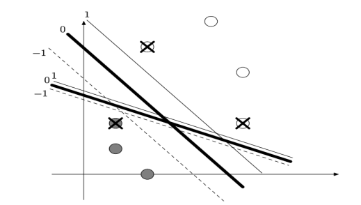

#### Exemple :

Soit S = {((4, 3), 1), ((0, 2), 1), ((0, 0), -1)}.

Le problème d'optimisation à résoudre est :

- Minimiser w₁² + w₂² + b²

sous les contraintes :

- 4w₁ + 3w₂ + b ≥ 1, 2w₂ + b ≥ 1, -b ≥ 1.

Les deux dernières équations impliquent w₂ ≥ 1 et donc w₁² + w₂² ≥ 1.

Nous déduisons la solution optimale : w₁ = 0, w₂ = 1, b = -1.

Équation de l'hyperplan optimal : x₂ = 1


### Kernel Perceptron :

On appelle noyau (kernel) toute fonction k : X × X → R qui peut être interprétée comme un produit scalaire dans un plongement Φ :
- k(x, x') = ⟨Φ(x), Φ(x')⟩
  
On peut appliquer le perceptron et les SVM en remplaçant ⟨xᵢ, xⱼ⟩ par k(xᵢ, xⱼ).

#### Kernel trick :
On obtient alors un classificateur
- f : x ↦ sign(Σᵢ=₁ⁿ αᵢyᵢk(x, xᵢ))

linéaire dans l'espace de plongement (avec toutes les garanties associées) et non linéaire dans l'espace initial sans avoir à effectuer le plongement !

#### Algorithme du perceptron à noyau :

**Entrée :** S = {(x₁, y₁), ..., (xₙ, yₙ)}, un échantillon complet linéairement séparable

```
α = → 0 ∈ Rₙ
Répéter
  Pour i = 1 à n
    Si yᵢ(Σⱼ=₁ⁿ αⱼyⱼk(xⱼ, xᵢ)) ≤ 0 alors
      αᵢ = αᵢ + 1
    FinSi
  FinPour
Jusqu'à ce qu'il n'y ait plus d'erreurs
```

**Sortie :** x ↦ sign(Σᵢ αᵢyᵢk(x, xᵢ))

**Expliquation :**
L'algorithme du perceptron à noyau est une extension du perceptron classique, qui permet d'apprendre des frontières de décision non linéaires. Pour cela, il utilise une fonction de noyau (kernel) qui transforme les données d'entrée dans un nouvel espace de caractéristiques où elles sont linéairement séparables. Voici les étapes de l'algorithme :

1. Initialisation : On initialise un vecteur de poids α de taille n avec des zéros. n est le nombre d'exemples dans l'ensemble d'apprentissage S.

2. Entraînement : On parcourt l'ensemble d'apprentissage S de manière itérative. Pour chaque exemple (xᵢ, yᵢ), on calcule la somme pondérée des noyaux entre xᵢ et tous les autres exemples xⱼ, multipliée par les poids αⱼ et les étiquettes yⱼ. Si le produit de yᵢ et de cette somme est inférieur ou égal à 0, cela signifie que la classification de l'exemple xᵢ est incorrecte. Dans ce cas, on met à jour le poids αᵢ en l'incrémentant de 1.

3. Répétition : On répète l'étape 2 jusqu'à ce qu'il n'y ait plus d'erreurs de classification dans l'ensemble d'apprentissage.

4. Prédiction : Une fois l'entraînement terminé, on obtient un classificateur non linéaire f(x) = sign(Σᵢ=₁ⁿ αᵢyᵢk(x, xᵢ)). Pour prédire l'étiquette d'un nouvel exemple x, on calcule la somme pondérée des noyaux entre x et tous les exemples d'apprentissage xᵢ, multipliée par les poids αᵢ et les étiquettes yᵢ. Enfin, on prend le signe de cette somme pour obtenir la prédiction finale.

L'idée clé de cet algorithme est l'utilisation d'une fonction de noyau qui permet de transformer les données d'entrée dans un nouvel espace où elles sont linéairement séparables. Le perceptron à noyau apprend alors une frontière de décision linéaire dans cet espace de caractéristiques transformé, mais cette frontière est non linéaire dans l'espace d'entrée initial.


```
LE RESTE DU SVM EST CHIANT DONC JE SKIP :)
```


# HMM - Hidden Markov Models :


